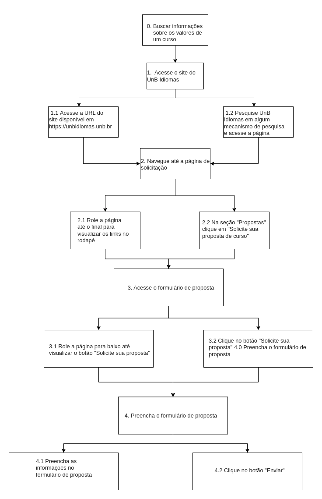
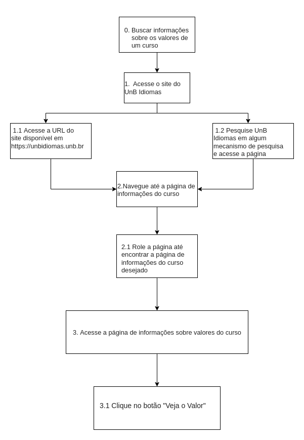

# Análise Hierárquica de Tarefas

## 1. Introdução

Outro método empregado para realizar a análise de tarefas que o usuário possa buscar durante a utilização do UnB Idiomas, foi a Análise Hierarquica de tarefas (AHT).

## 2. O método AHT

 
O método AHT consiste na identificação das tarefas que usuário podem necessitar executar utilizando a plataforma em análise pelos Designers, e ilustrar sua experiência no site até que o objetivo da tarefa esteja completo. Para que a análise ficasse mais intuitiva e compreensível o método foi empregado utilizando as representações:

-  Gráfica por meio de imagens de diagrama do fluxo do usuário pelo sistema, e legendas de apoio
-  Textual e descritiva das tarefas a serem realizadas

## 3. Motivo da escolha

O método apresenta uma visão ampla acerca dos objetivos do usuário no sistema em análise, e por conseguinte auxilia os Designers na compreensão dos sentimentos, dificuldades, barreiras e necessidades em relação à aplicação como um todo. O método funciona muito bem para analisar o fluxo de usuário em tarefas relativamente mais complexas e que envolvem mais passos. 

## 4. A análise

Abaixo podem ser visualizadas a análise de duas tarefas no sistema do UnB Idiomas, solicitar uma proposta de curso, a busca de informações sobre os valores de um curso.

 

## 4.1 Solicitar uma proposta de curso
 
!!! info "Objetivo"

    Realizar uma solicitação para um curso 

!!! note "Passos em ordem cronológica"
    <ol start="0">
        <li>Realizar uma solicitação para um curso</li>
        <li>
            Acesse o site do UnB Idiomas  
            1.1 Acesse a URL do site disponível em https://unbidiomas.unb.br    
        </li>
        <li>
            Navegue até a página de solicitação  
            2.1 Role a página até o final para visualizar os links no rodapé  
            2.2 Na seção "Propostas" clique em "Solicite sua proposta de curso"
        </li>
        <li>
            Acesse o formulário de proposta  
            3.1 Role a página para baixo até visualizar o botão "Solicite sua proposta"  
            3.2 Clique no botão "Solicite sua proposta" 
      4.0 Preencha o formulário de proposta
        </li>
        <li>
            Preencha o formulário de proposta  
            4.1 Preencha as informações no formulário de proposta  
            4.2 Clique no botão "Enviar"
        </li>
    </ol>

### Fluxo gráfico

A ilustração do fluxo do usuário para realizar uma solicitação para um curso pode ser visualizada na (Figura 01).

<figure markdown>

</figure>

###### Figura 01 - Ilustração do fluxo de solicitação para um curso. Fonte: Autoria própria.

## 4.2 Busca de informações sobre os valores de um curso

!!! info "Objetivo"

    Buscar informações sobre os valores de um curso 

!!! note "Passos em ordem cronológica"
    <ol start="0">
        <li>Buscar informações sobre os valores de um curso </li>
        <li>
            Acesse o site do UnB Idiomas  
            1.1 Acesse a URL do site disponível em https://unbidiomas.unb.br    
        </li>
        <li>
            Navegue até a página de informações do curso  
            2.1 Role a página até encontrar a página de informações do curso desejado
        </li>
        <li>
            Acesse a página de informações sobre valores do curso  
            3.1 Clique no botão "Veja o Valor"
        </li>
    </ol>

### Fluxo gráfico

A ilustração do fluxo do usuário para Buscar informações sobre os valores de um curso pode ser visualizada na (Figura 02).

<figure markdown>

</figure>

###### Figura 02 - Ilustração do fluxo de usuário para buscar informações sobre os valores de um curso. Fonte: Autoria própria.

## 5. Referências Bibliográficas

- BARBOSA, Simone; SILVA, Bruno. "Interação Humano-Computador". Elsevier Editora Ltda, 2010.
- DIAPER, Dan; STANTON, Neville. "The handbook of task analysis for human-computer interaction". Mahwah, NJ: Lawrence Erlbaum Associates, 2004.

## Histórico de versões
|    Data    | Versão |       Descrição       | Autor(es) | Revisor |
| :--------: | :----: | :-------------------: | :-------: | :-----: |
| 07/12/2022 |  1.0   | Adição da análise AHT |   Eric    | Thiago  |

