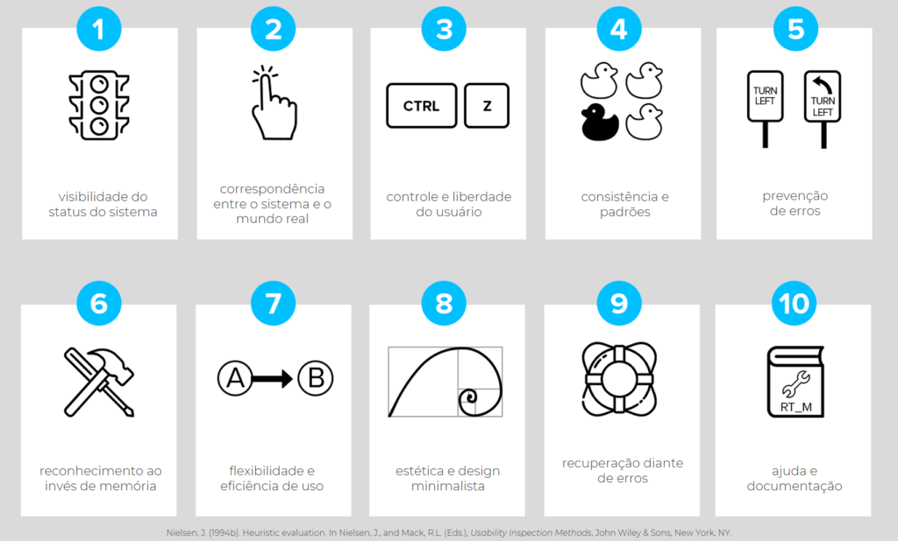

# Planejamento da avaliação

!!! info "Autor"
    Desenvolvido por Eric Chagas

###### Anotação 01 - Autor. Fonte: Autoria própria.

## Avaliação Heurística

É um método de avaliação criado para encontrar problemas de usabilidade durante um processo de design iterativo. A equipe decidiu utilizar a Heurística de Nielsen para fazer essa avaliação, onde seguiremos as heurísticas explicitadas na Figura 1:

<figure markdown>

<figcaption>Figura 01 - 10 Heurísticas de Nielsen. Fonte: Entendendo as 10 Heurísticas de Nielsen para melhorar a experiência do usuário. </figcaption>
</figure>

## Método

O método utilizado para a avaliação será o baseado na experiência de Santinho (2001), que também é proposto no artigo Avaliação Heurística de sítios na web (MACIEL et al., [s.d.]).

### Esse método baseia-se em:

1. Classificar o problema: quando um problema qualquer for detectado, classifica-lo em uma das dez heurísticas de Nielsen (1994), considerando também a
adaptação destas a Web.
2. Anotar na tabela: anotar o problema na tabela correspondente.
3. Atribuir o Grau de Severidade: atribuir o grau de severidade (0 a 4) para tal
problema.
4. Recomeçar novamente: aplicar o método novamente até não encontrar mais
problemas de usabilidade.

## Contexto atual do site

Para realizar a avaliação do site, é necessário ter um entendimento geral acerca da situação atual e do contexto de uso. Os perfis de utilização e contexto de uso do site serão mais detalhados no decorrer do projeto, em suas devidas entregas, no entanto, para o planejamento da avaliação Heurística do UnB Idiomas, foram reunidas as seguintes informações, que podem ser verificadas nas Anotações 02 e 03.

!!! abstract "Perfis de usuário"

    - Alunos de graduação e pós-graduação matriculados na UnB, com idade à partir de 16 anos
    - Pessoas não ligadas à UnB, com idade à partir dos 12 anos
    - Professores e funcionários da UnB, com idade à partir dos 25 anos

###### Anotação 02 - Perfis de usuário. Fonte: Autoria própria.

!!! abstract "Contextos de uso"

    - Acessar o site para obter informações gerais sobre a UnB e buscar links para outros portais da universidade
    - Acessar o site para obter informações sobre a UnB Idiomas e suas redes sociais e informações de contato
    - Acessar o site para obter informações sobre os cursos de idiomas oferecidos pela UnB Idiomas
    - Matricular-se em cursos oferecidos pela UnB Idiomas
    - Já cursando algum curso na UnB Idiomas, resolver problemas relacionados aos cursos 

###### Anotação 03 - Contextos de uso. Fonte: Autoria própria.

## Framework DECIDE

Para planejar a avaliação foi utilizado o framework DECIDE (ASHA).

!!! info "Autor"
    Desenvolvido por Thiago Cerqueira

###### Anotação 04 - Autor. Fonte: Autoria própria.

### Objetivos de avaliação (Determine)

Com objetivo de obter conhecimento e experiência ao mesmo tempo realizando uma tarefa
do IHC - Interação Humano Computador, com intuito de avaliar e identificar problemas na
interface com objetivo de solucionar problemas identificados.

### Questões à serem respondidas: (Explorer)

1. O usuário consegue acessar o sistema?
2. O usuário consegue cumprir seu objetivo?
3. Com que eficácia o usuário atinge seu objetivo?
4. Existe alguma tela que te deixa confuso?
5. O usuário tem facilidade ao identificar a funcionalidade de cada tela intuitivamente?
6. Quais são os problemas que impedem o usuário de cumprir seus objetivos?
7. Qual a gravidade desses problemas?

###### Perguntas inspiradas no livro Interação “humano-computador” -Barbosa Simone.

### Métodos de avaliação (Choose)

Dos métodos utilizados o mais coerente seria a avaliação heurística, para encontrar
problemas de usabilidade durante o processo de design interativo.”Para avaliar o nível de
usabilidade das interfaces computacionais existem métodos conhecidos como a Inspeção
de Usabilidade. Estes métodos identificam de maneira fácil e com baixo custo, potenciais
problemáticas na qualidade da interação entre o homem e o sistema computacional.”.

### Necessidades na hora da avaliação (Identify)

Basicamente foi utilizado um computador de uso privado e acesso a internet.

### Questões éticas (Decide)

Na avaliação heurística não se utiliza usuários, portanto não é necessário ter um contrato
ou se preocupar com questões relacionadas à legislação

## Referências:

>[1] MACIEL, C. et al. Avaliação Heurística de Sítios na Web. Disponível em: <https://www.addlabs.uff.br/Novo_Site_ADDLabs/images/documentos/publicacoes/publicacoes_pdf/trabalhos_anais_congresso/2004/20130809151827_2004%20-%20Avaliao%20heurstica%20de%20stios%20na%20web.pdf>. Acesso em: 23 nov. 2022.

>[2] Disponível em: <https://medium.com/signainfo/entendendo-as-10-heurísticas-de-nielsen-para-melhorar-a-experiência-do-usuário-86f3c14c0586>. Acesso em: 23 nov. 2022.

>[3] UnB idiomas. Disponível em: <http://www.unbidiomas.unb.br>. Acesso em: 23 nov. 2022.

>[4] Entendendo as 10 Heurísticas de Nielsen para melhorar a experiência do usuário.Disponível em: <https://medium.com/signainfo/entendendo-as-10-heurísticas-de-nielsen-para-melhorar-a-experiência-do-usuário-86f3c14c0586>. Acesso em: 23 nov. 2022.

>[5] Disponível em: <https://www.asha.org/siteassets/uploadedFiles/ASHA/Research/EBP/The-DECIDE-Framework.pdf>. Acesso em: 23 nov. 2022b.

## Histórico de versão

| Versão | Data       | Descrição                           | Autor(es)                          | Revisor    |
| ------ | ---------- | ----------------------------------- | ---------------------------------- | ---------- |
| 1.0    | 23/11/2022 | Adição do planejamento da avaliação | Eric Chagas                        | Igor Silva |
| 1.1    | 23/11/2022 | Framework Decide                    | Eric Chagas,   Thiago Cerqueira | Igor Silva |

##### Tabela 01 - Histórico de versões. Fonte: Autoria própria