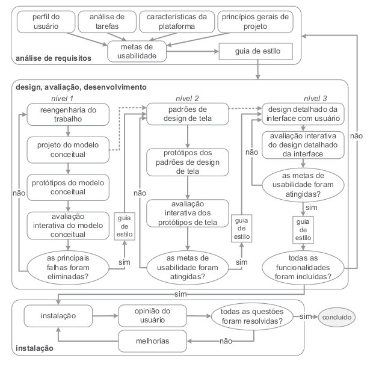

# Processo de Design

O design é um processo que parte de três etapas básicas, sendo elas:

- Análise da situação atual: onde se estuda e intrerpreta a situação atual;
- Síntese de uma intervenção: a partir da interpretação dessa situação é proposta e planejada uma intervenção/mudança no projeto;
- Avaliação da nova situação: é feita uma comparação entre as etapas do processo para avaliação dos impactos causados, podendo ser encaixadas novas propostas em um processo iterativo, que permite por novas análises que o design seja aprimorado novamente, repetindo o ciclo.

Entendendo a atividade de design como "enquadrar uma situação num tipo geral de problema cuja forma de solução seja conhecida", foram inventados ciclos de vida a partir de estudos que reuniam as etapas comuns durante o processo de design, de forma a servir como referência para realizar um processo bem sucedido.

Dentre alguns dos ciclos avaliados para o design desse projeto temos:

## Ciclo de vida simples

###### Figura 01: Ciclo de vida simples. Fonte: (BARBOSA et al., 2010)

No ciclo apresentado na (Figura 01), é definida uma versão simplificada e linearizada do processo geral de desenvolvimento, incluindo análise, desenvolvimento e avaliação após implantação. 

- (re) design: o designer explora diferentes ideias alternativas de
design para elaborar uma solução adequada às necessidades
e requisitos definidos na atividade de análise;
- Versões interativas: para melhor avaliar o design resultante
das propostas de solução que simulem o funcionamento da
interface e deixem clara a intenção projetada, facilitando a
participação do usuário durante a avaliação de IHC. 

## Ciclo de vida em estrela

###### Figura 02: Ciclo de vida em estrela. Fonte: (BARBOSA et al., 2010)

Nesse ciclo, apresentado na (Figura 02) a avaliação é a atividade central e sempre deve ser executada após outras atividades. Cabe também ao designer decidir de acordo com a situação e a elaboração de seu raciocínio em torno do processo sobre a partir de qual etapa ele deve começar. Dentre as etapas do ciclo temos:

- Análise de tarefas, usuários e funções: é a atividade responsável
pelo aprendizado da situação atual e pelo levantamento das necessidades e oportunidades de melhoria;

- Especificação de requisitos: define os problemas que devem ser
resolvido com o projeto de uma solução IHC;

- Projeto conceitual e especificação do design: onde a solução de
IHC é concebida;

- Prototipação: as versões interativas das propostas de solução são
elaboradas para serem avaliadas;

- Implementação: onde o sistema interativo final é desenvolvido, ela
é tema central da eng. de software;

- Avaliação: sempre deve ser executada após outras atividades
para análise e se detectada alguma inconsistência volta para a atividade adequada para corrigir. 

## Ciclo de vida de Mayhew

###### Figura 03: Ciclo de vida de Mayhew. Fonte: (BARBOSA et al., 2010)

O ciclo de Mayhew mostrado na (Figura 03) é um diagrama que descreve de maneira aprofundada as etapas do processo de design, situações do contexto de uso e proposições que devem ser feitas para avaliar o desenvolvimento ao longo do desenvolvimento. Ele possui diversas etapas a serem seguidas, que são agrupadas a partir de suas três principais propostas:

- Análise de requisitos: são criadas as metas de usabilidade com base
no perfil dos usuários, análise de tarefas, possibilidades e limitações da plataforma em que o sistema será executados e princípios gerais de design de IHC;
- Design, avaliação, desenvolvimento: sequência de etapas onde é elaborada a solução para atingir as metas de usabilidade, também dividido em três níveis de etapas sequenciais;
- Instalação: após implantada, são coletadas as avaliações dos usuários para que sejam feitos futuros refinamentos.

## Escolha do modelo:

Para esse projeto, o cronograma de atividades e as tarefas que serão realizadas pelos membros foram definidos a partir do ciclo de vida de Mayhew, por ser o diagrama de processos mais detalhado dentre as opções, fornecendo maior organização e orientação entre as etapas, além de auxiliar no processo didático dos integrantes.

## Referências:

> BARBOSA, S.D.J.; SILVA, B.S. Interação Humano-Computador. Editora Campus-Elsevier, 2010. P. 92-130.

# Histórico de versão

| Versão | Data       | Descrição                                                   | Autor               | Revisor |
| ------ | ---------- | ----------------------------------------------------------- | ------------------- | ------- |
| 1.0    | 23/11/2022 | Criação do documento                                        | Igor Silva de Paiva | Artur   |
| 1.1    | 23/11/2022 | Adicionando legendas nas imagens                            | Igor Silva de Paiva | Artur   |
| 1.2    | 12/11/2022 | Corrigidas legendas, fontes e chamadas das figuras no texto | Eric                | Igor    |